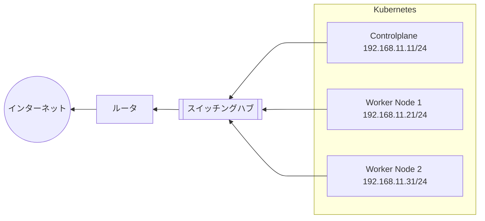
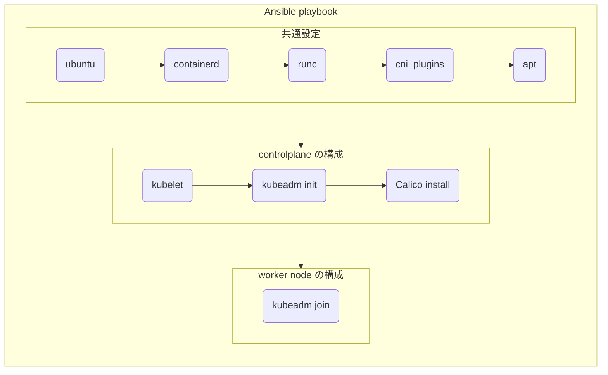

## はじめに

本記事は、Raspberry Pi 3 台を使って自宅に Kubernetes クラスタを構築するいわゆる「おうち Kubernetes」を Ansible で実装したのでその方法を紹介をするものである。

Ansible を活用して、自動化・再現性の高い環境構築を実現したプロセスについて、具体的な設定や構築手順を交えて解説する。

## 使用したハードウェア


| 商品名                                                           | 用途                                         | 単価                 | 数量 | 小計    |
| ---------------------------------------------------------------- | -------------------------------------------- | -------------------- | ---- | ------- |
| Raspberry Pi 4 model B 8GB                                       | controlplane                                 | ¥12,500              | 1    | ¥12,500 |
| Raspberry Pi 4 model B 8GB                                       | worker                                       | ¥8,970,<br /> ¥9,980 | 2    | ¥18,950 |
| GeekPi PoE HAT                                                   | LAN 経由で電源供給するため                   | 2,079                | 1    | ¥2,079  |
| GeekPi クラスターケース冷却ファンとヒートシンク付き              |                                              | 1,999                | 1    | ¥1,999  |
| [TPLink スイッチングハブ 5 ポート PoE+](https://amzn.to/3Tx7kUX) |                                              | 4,280                | 1    | ¥4,280  |
| [LAN ケーブル](https://amzn.to/3Txckc6)                          | いくつか手元にもあったが短いのが欲しくて購入 | 639                  | 1    | ¥639    |
| [SD カード 64GB](https://amzn.to/4k7P2EJ)                        | OS                                           | 742                  | 3    | ¥2,226  |

合計 42,673 円となった。（やはり昨今の半導体不足が影響してて高額になってしまった、、、）

Raspberry Pi はフリマアプリから中古品を購入し、それ以外は基本 Amazon で購入した。既に Amazon からなくなっているものもいくつかあったが購入履歴から遡れるものはリンクを貼っておいた。

## 完成図


## 物理構築

Raspberry Pi を使った物理的な組み立てについては、以下のリポジトリが写真付きで非常に分かりやすかった。

https://github.com/CyberAgentHack/home-kubernetes-2020/tree/master/how-to-create-cluster-physical

余談だが 1 段 1 段の間が意外とスペースがなく、PoE HAT の位置や向きを間違えていたりすると入り込まない。私は何回か失敗しながらもやり直しながら完成できた。

## 論理構築

下記のスペックで構成した。

- OS: Ubuntu Server LTS 22.04 (64-bit)
- コンテナランタイム: Containerd v2.0.1
- コンテナオーケストレーション: Kubernetes v1.32.0
- CNI: Calico v3.29.1

また、構成管理を全て Ansible に任せることで、何かしらのトラブルが発生してクラスタを再構築する際も、コマンド一発で全く同じ状態を作り直せる点が大きな推しポイントである。（完全自動化できていない点については後述。）

そして、Kubernetes クラスタの構成としては下記とした（カッコ内はホスト名）。

- コントロールプレーン 1 台（controlplane）
- ワーカーノード 2 台(worker-node1, worker-node2)

Ansible で構成管理を行う前段階としていくつか必要なステップがあるので、それらを順に行っていく。

### ネットワーク設計

Kubernetes クラスタを構築する前に、Node 用と Pod 用のサブネットを決めておく。

まずは Node 用のサブネットだが、下記のようにした。自宅のネットワークアドレスが `192.1968.1.0/24` で、DHCP で振られた IP アドレスをそのまま使うようにした。予め、DHCP 配布範囲を確認して、IP の競合が起きないように、Pool の開始をずらしておいた。

- Controlplane: 192.168.1.11
- Worker Node1: 192.168.1.21
- Worker Node2: 192.168.1.31

Pod 用のサブネットは、基本的にローカルネットワークで使用していない IP アドレスを使う必要があるため `10.244.0.0/16` にした。

全体間を図示すると下記のような構成となった。



### Ubuntu マシンの準備

まずは OS イメージを SD カードに焼く。今回は、公式が提供している Raspberry Pi Imager を使って Ubuntu を SD カードに焼いた。

https://www.raspberrypi.com/software/

UI なども非常にシンプルで流れに沿って操作していくと分かると思うのでスクショなどは割愛する。最低限書きを設定すれば問題ないと思う。

- ホスト名の指定
- 無線 LAN(Wi-Fi)の設定
- SSH の有効化

Raspberry Pi 本体に SD カードを差し込んで起動したら、SSH できることを確認する。

```sh
# ユーザ名、ホスト名適宜変更
$ ssh root@controlplane.local

# Netplan の設定ファイルを作成
ubuntu $ sudo vim /etc/netplan/99-custom-conf.yaml

ubuntu $ sudo chmod 600 /etc/netplan/99-custom-conf.yaml

ubuntu $ sudo reboot
```

Raspberry PI の IP アドレスを固定するため、下記の内容を書いて保存する。

```yaml title="/etc/netplan/99-custom-conf.yaml" showLineNumbers
network:
  version: 2
  renderer: networkd

  ethernets:
    eth0:
      dhcp4: no
      addresses:
        - 192.168.11.11/24 # [!code ++]
      gateway4: 192.168.11.1
      nameservers:
        addresses:
          - 192.168.11.1
```

ちなみに Netplan とは、Ubuntu のネットワーク設定を YAML で書ける仕組みである。`/etc/netplan/50-cloud-init.yaml` が cloud-init で使われるファイルとして既存であると思うので、50 以降の数字をファイル名の頭につけておくと上書き設定される。

https://qiita.com/yas-nyan/items/9033fb1d1037dcf9dba5

続いて SSH 設定を行う。

```sh
# 操作用の端末で鍵の作成
$ ssh-keygen -t rsa -b 4096

# Raspberry Pi 側にコピー
$ ssh-copy-id root@controlplane.local

$ ssh root@controlplane.local

ubuntu $ sudo vim /etc/ssh/sshd_config.d/01-custom.conf

ubuntu $ sudo chmod 600 /etc/ssh/sshd_config.d/01-custom.conf
```

SSH 設定ファイルを作成し、下記を記載して保存する。内容は適宜変えてもらいたいが、私の場合は公開鍵認証を使用して、デフォルトの Port を使わないようになどよくやる設定を記述している。

```ssh-config title="/etc/ssh/sshd_config.d/01-custom.conf" showLineNumbers
Port xxxx
PubkeyAuthentication yes
PasswordAuthentication no
PermitRootLogin no
```

準備できたら、設定を読み込むために SSH を再起動しておく。

```sh
ubuntu $ systemctl daemon-reload

ubuntu $ sudo sshd -T

ubuntu $ systemctl restart ssh
ubuntu $ systemctl status ssh

ubuntu $ sudo ss -lt
```

ここまでを使用する Raspberry Pi の台数分行う。

### Ansible での Kubernetes クラスタ構築

下記のリポジトリにて、Kubernetes クラスタを構築するための Ansible Playbook を公開している。Role ごとに分割して実装しており、必要に応じて変数を外部注入することでカスタマイズできるように実装した。

https://github.com/ega4432/kubernetes-at-home

まず Ansible playbook 全体の流れを図示すると下記のようになる。



`site.yaml` をエントリーポイントとして上から直列で処理が流れるようになっていて、最初に全体共通に必要な処理についてはすべてのノードに対して操作を行い、 controlplane の構成、worker nodes の構成へと流れるようにした。

#### 動作確認

```sh
# ノードの状態を確認
$ kubectl get nodes -o wide
NAME            STATUS   ROLES           AGE    VERSION   INTERNAL-IP     EXTERNAL-IP   OS-IMAGE             KERNEL-VERSION     CONTAINER-RUNTIME
controlplane1   Ready    control-plane   61d    v1.32.0   192.168.11.30   <none>        Ubuntu 24.04.1 LTS   6.8.0-1020-raspi   containerd://2.0.1
worker-node1    Ready    <none>          61d    v1.32.0   192.168.11.31   <none>        Ubuntu 24.04.1 LTS   6.8.0-1020-raspi   containerd://2.0.1
worker-node2    Ready    <none>          61d    v1.32.0   192.168.11.32   <none>        Ubuntu 24.04.1 LTS   6.8.0-1020-raspi   containerd://2.0.1

# nginx pod を作成
$ kubectl run nginx --image nginx
pod/nginx created

# deployment を作成
$ kubectl create deployment test --image busybox --replicas=3  -- sleep infinity
deployment.apps/test created

# 各 pod の状態を確認
$ kubectl get po -o wide
NAME                    READY   STATUS    RESTARTS       AGE    IP               NODE           NOMINATED NODE   READINESS GATES
nginx                   1/1     Running   1 (104d ago)   61d    10.244.180.195   worker-node1   <none>           <none>
test-768588bbbf-4jfsw   1/1     Running   0              11s    10.244.180.200   worker-node1   <none>           <none>
test-768588bbbf-9wqtx   1/1     Running   0              11s    10.244.203.132   worker-node2   <none>           <none>
test-768588bbbf-tvbfj   1/1     Running   0              11s    10.244.180.199   worker-node1   <none>           <none>
```

ちゃんと pod が起動していることと、worker-node1, 2 に負荷分散されていることが確認できた。

#### 工夫ポイント

今回工夫したポイントを箇条書きで記載する。

- Play とロールの分割
  - 前述したように共通処理→controlplane→worker node とすることで、責任の分離と最後の worker node の部分には並列処理を実現している。
- inventory の活用
  - 各ノードについては Ansible の inventory を使ってそれぞれ controlplane, workers にグループを定義した。
- handler と notify の使用
  - xxx を行ったら yyy をする、ということをシンプルに実装できる。今回始めて使ってみた。
- 冪統制の担保
  - 完璧ではないがやれるところはやった。例えば途中で失敗して、途中からリトライした場合も最終的に同じような状態になるように実装した。

#### 未実装ポイント

逆に未実装のところだが、controlplane の処理のあと、worker node で失敗するように現状なっている。
原因は分かっていて、`kubeadm init` の後 Ready になるまで時間がかかるので、待機する必要がある。

## まとめ

今回、Ansible を使って「おうち Kubernetes クラスタ」の構築にチャレンジした。

Ansible は、OS のセットアップ、ツールのインストール、クラスタの構築まで、一連のプロセス自動化に非常に向いていることを再確認できた。

これまで手動でコマンドを実行するプロセスをコード化しておくことで、運用コストの削減と高い再現性を実現できることを改めて実感した。

また、今思いつく限りでも結構試したいことがいっぱいあるので、地道に改善を重ねていけたらと思う。

- ログ基盤の構築
- 外部からアクセスできるようにする
- なにかしらサイトを外部に公開する
- LLM を動かしてみる（スペック足りないかも、、、）

また、Kubernetes クラスタを一から作って運用することは非常に大変なことだが、クラウドを利用している側では普段気づけないことや考慮しないことにも視点が広がり、得られる知見も多いのではないかと思う。

興味がある方はぜひ本記事を参考にしていただきトライしてもらえたらと思う。

## 参考

https://github.com/ega4432/kubernetes-at-home

https://github.com/CyberAgentHack/home-kubernetes-2020

https://qiita.com/takumi3488/items/2eb4692a5672ee475998

https://zenn.dev/wurly/articles/307476bc5b70ab

https://zenn.dev/kznrluk/articles/0cc24e14fec36b
