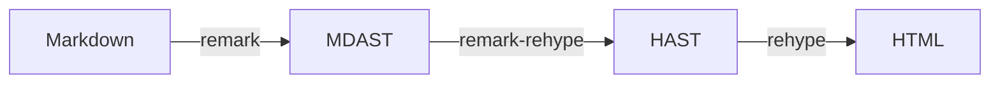

## はじめに

このブログで使っているシンタックスハイライターを Prism から Shiki へ切り替えたので、Astro で Shiki を使う際の設定方法や移行手順をまとめる。

シンタックスハイライターとは、コードブロック内のコードを言語に応じて適切に色付けし、可読性を高める機能を提供するものである。例えば下記のようなもので、技術ブログやドキュメントなどにおいては、読者がコードを理解しやすくするための重要な要素の一つだ。

Markdown 内でコードを 3 つのバッククォートで囲んだ状態で、かつ言語を指定すると

````plain
```py
def greet(name):
    print("Hello, " + name)

if __name__ == "__main__":
    greet("Alice")
```
````

このように指定された言語の文法を解析して色付けした状態で表示される。

```py showLineNumbers
def greet(name):
    print("Hello, " + name)

if __name__ == "__main__":
    greet("Alice")
```

## Prism から Shiki へ切り替えた背景

これまで当ブログでは Prism を使用してきたが、いくつかの理由から Shiki への移行を決断した。

### Prism の開発停滞

Prism のリポジトリを確認すると、Issue や Pull Request が溜まっていてメンテナンスが活発とは言えない状況だ。

https://github.com/PrismJS/prism

### カスタマイズの限界

以前、ファイル名表示機能を実現するために remark プラグインを自作したことがあるが、unified エコシステムの理解が不十分なまま実装してしまい、後から見返すと不適切な実装になっていた。この経験から、「Markdown 処理の仕組み」を正しく理解した上で、適切なツールを選ぶ必要性を感じた。

### Shiki の魅力

一方、Shiki は以下の点で魅力的だった。

- VS Code のシンタックスハイライトエンジンとして使われており、継続的にメンテナンスされている
- `rehype-pretty-code` プラグインが強力で、ファイル名表示や行番号などのハイライト機能を簡単に実現できる
- VS Code と同じ TextMate 文法を使用しているため、構文解析の精度が高い

今回の移行作業の詳細は、以下の 2 つの PR で対応した。

https://github.com/ega4432/egashira.dev/pull/597

https://github.com/ega4432/egashira.dev/pull/599

その他 Prism と Shiki の比較についてはこちらの記事が参考になるので気になる人は参照してもらいたい。

https://zenn.dev/team_zenn/articles/zenn-prism-to-shiki

## Markdown 処理の仕組み

Prism と Shiki の違いを理解するには、Markdown が HTML に変換される仕組みを理解する必要がある。多くの静的サイトジェネレーター（Astro、Next.js、Gatsby など）は unified エコシステムを使用しており、以下のような変換プロセスを経る。



1. **Markdown → MDAST**: remark が Markdown を構文木（MDAST）に変換
2. **MDAST → HAST**: remark-rehype が Markdown の構文木を HTML の構文木（HAST）に変換
3. **HAST → HTML**: rehype が HTML の構文木を実際の HTML 文字列に変換

重要なのは、**remark プラグインは MDAST を操作し、rehype プラグインは HAST を操作する**という点である。この変換プロセスにおいて、**プラグインの実行順序は非常に重要**である。順番を間違えると、期待した効果が出なかったり、データが消えてしまったりといったトラブルが発生する。

以前、筆者が remark プラグインを自作した際に、この順序の重要性を理解していなかったため、期待通りに動作しないという問題に直面した。unified エコシステムを正しく理解することで、このようなトラブルを避けることができる。

## Astro での Shiki 導入・設定方法

それでは、実際に Astro で Shiki を使うための設定方法を見ていこう。

### パッケージのインストール/アンインストール

Shiki 自体は Astro 内に組み込まれているので別途インストール不要だが、カスタマイズに必要なパッケージのインストールを行う。また、これまで使っていて不要になったパッケージをアンインストールする。

```sh
$ npm install -D rehype-pretty-code @shikijs/transformers

$ npm uninstall rehype-prism-plus
```

- [rehype-pretty/rehype-pretty-code](https://github.com/rehype-pretty/rehype-pretty-code)
  - Shiki をベースにした rehype プラグイン。コードブロックのハイライトに加えて、タイトル表示や行番号、Diff 表示などの機能を提供する。
- [@shikijs/transformers](https://shiki.style/packages/transformers)
  - Shiki の変換機能を拡張するパッケージ。高度なカスタマイズ行う際に必要。

### astro.config.mjs の設定

次に、プロジェクトの設定を変更していく。

```js title="astro.config.mjs" showLineNumbers
// 他のパッケージは省略
import { transformerNotationDiff } from "@shikijs/transformers"; // [!code ++]
import { rehypePrettyCode } from "rehype-pretty-code"; // [!code ++]
import rehypePrismPlus from "rehype-prism-plus"; // [!code --]
import remarkCodeTitles from "./src/lib/utils/remark-plugins/remark-code-titles"; // [!code --]

export default defineConfig({
  // 他の設定は省略
  markdown: {
    syntaxHighlight: 'prism' // [!code --]
    syntaxHighlight: false,　// Astro 組み込みの syntaxHighlight を無効化 [!code ++]
    remarkPlugins: [
      // 他の remark plugin の設定は省略
      remarkCodeTitles // [!code --]
    ]
    rehypePlugins: [
      // 他の rehype plugin の設定は省略
      [ // [!code --]
        rehypePrismPlus, // [!code --]
        { // [!code --]
          ignoreMissing: true // [!code --]
        } // [!code --]
      ] // [!code --]
      [
        rehypePrettyCode, // [!code ++]
        { // [!code ++]
          theme: "github-dark-default", // [!code ++]
          transformers: [transformerNotationDiff()] // Transformer を設定 [!code ++]
        } // [!code ++]
      ]
    ]
  }
});
```

設定のポイントの詳細を以下にまとめる。

1. `syntaxHighlight: false`

Astro には組み込みの Shiki サポートがあるが、`rehype-pretty-code` を使う場合は `syntaxHighlight: false` に設定する必要がある。これは、組み込みの Shiki と `rehype-pretty-code` が競合するのを防ぐためである。

2. rehype プラグインとして設定

`rehype-pretty-code` は rehype プラグインなので、`rehypePlugins` 配列に追加する。プラグインの順序は重要で、他の rehype プラグイン（`rehype-slug` や `rehype-autolink-headings` など）がある場合は、それらの後に配置することを推奨する。

3. テーマの選択

`theme` オプションで使用するテーマを指定できる。Shiki は非常に多くのテーマを提供しているがシンプルなものが好みで、かつ他のサービスなどと比較して奇抜なものだと読者目線で見慣れないだろうと思い `github-dark-default` を選択した。デフォルトは `github-dark-dimmed` である。[^1]

https://shiki.style/themes

4. Transformer の設定

`transformers` オプションで、Shiki の変換機能を拡張できる。例えば `transformerNotationDiff()` を使うことで、コードブロック内で追加・削除行を表現できるようになる。

````plain
```js
console.log('removed'); // [!code --]
console.log('added'); // [!code ++]
```
````

```js
console.log("removed"); // [!code --]
console.log("added"); // [!code ++]
```

他にも、以下のような Transformer が用意されているが、一旦必要になったら追加しようと思う。

### CSS の適用

Shiki は HTML への変換までを、すなわち class の付与までが行われる。そのため、別途 CSS は用意しないといけない。`src/styles/code-block.css` 内に、 Shiki で生成される DOM 及び class 名に対してのスタイリングを定義した。

## まとめ

このブログでは、Prism から Shiki へシンタックスハイライターを移行した。Prism の開発停滞や、カスタマイズの限界を感じたことが移行の理由である。

Shiki は VSCode と同じ TextMate 文法を使用し、構文解析の精度が高い。ビルド時に処理が完了するため、クライアントサイドでの JavaScript が不要になり、初期表示が高速になる。`rehype-pretty-code` を使うことで、ファイル名表示や行番号、Diff 表示などの機能を簡単に実装でき、より実用的なコードブロックを作成できるようになった。

## 参考

https://docs.astro.build/ja/guides/syntax-highlighting/

https://amzn.to/3Zvedcj

https://amzn.to/3EjZbPF

https://amzn.to/4qFqYwU

[^1]: https://rehype-pretty.pages.dev/#:~:text=The%20default%20theme%20is%20github%2Ddark%2Ddimmed.
