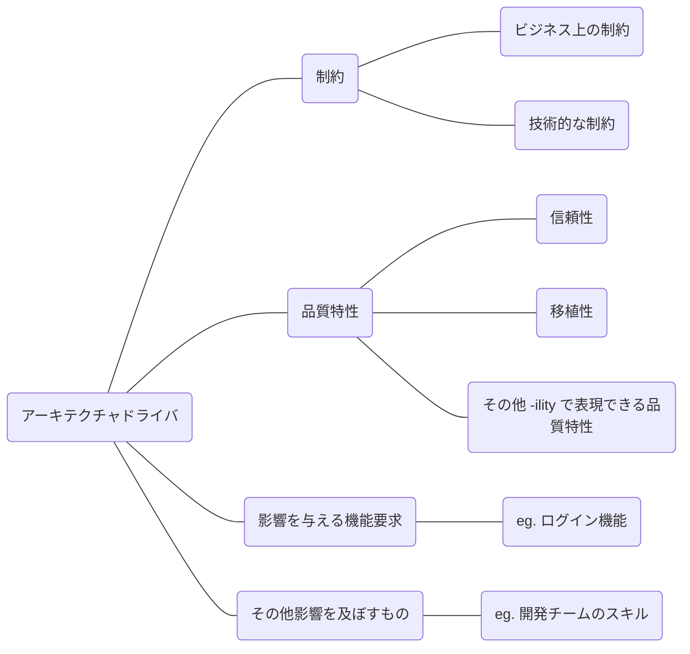
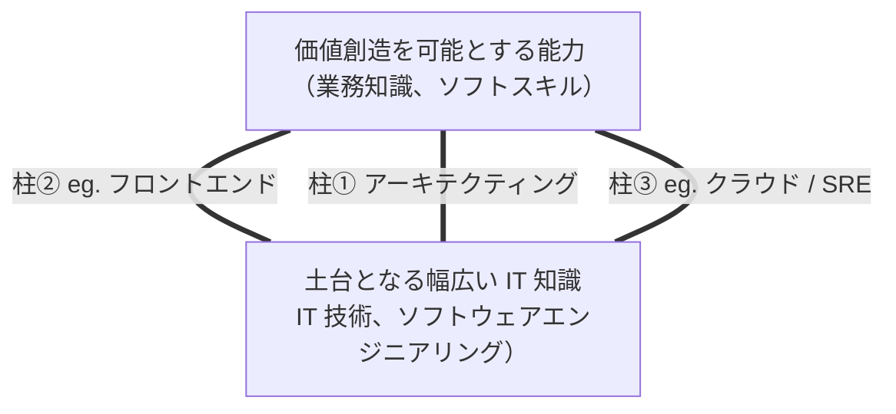

## はじめに

ふとした時に、いわゆるエンジニアとアーキテクトって仕事の内容やスタンス、視点にどういう違いがあるのか気になった。会社によっては年次や等級が上がればロールとして自動的にアーキテクトの肩書になる組織もなくはないだろう。

そうした時に入門にちょうど良さそうな本書を見つけたので手にとって読んでみることにした。

結果として、アーキテクトの仕事についての解像度を上げることができたし、将来的にアーキテクトを目指す人はもちろん、アーキテクトの仕事について興味があるくらいの温度感の人に広くおすすめできる一冊だと思う。

https://amzn.to/4pny9t9

## アーキテクトの仕事

最初は、現在を取り巻くソフトウェア開発の現状に触れつつ、ビジネスのスピードが上がると同時に、時代とともにソフトウェア開発の流れも高速化していることが冒頭で語られていた。

実際に本番で稼働するソフトウェアは、規模が大きくなるにつれて複雑度が増す。そのように依存関係や複雑度の高い状態を**巨大な泥団子**と表現し、アンチパターンだと述べられていた。

そのような巨大な泥団子状態を避けるために、**良いコード**を書く必要がある。そして良いコードを維持するには、開発者のレベルに依存しないよう一貫した方針や仕組みが必要となり、それが**アーキテクチャ**というふうに紹介されていた。

https://amzn.to/49mcmv3

私は知らなかったが、情報処理推進機構(IPA)が定めるアーキテクトには 3 つの専門分野に区分されているらしい。

- アプリケーションアーキテクチャ
- インテグレーションアーキテクチャ
- インフラストラクチャーアーキテクチャ

本書にも書いてあったが、これまでに比べるとアーキテクトにはより広範囲な知識が求められるようになってきていて、上記の 3 つの垣根は次第に低くなりつつあると思う。

また、IPA ではシステムアーキテクト像と業務内容について下記のように定義されている。

> 情報システム戦略を具体化するための情報システムの構造の設計や、開発に必要となる要件の定義、システム方式の設計及び情報システムを開発する業務に従事し、次の役割を主導的に果たすとともに、下位者を指導する。

https://www.ipa.go.jp/jinzai/skill-standard/plus-it-ui/itss/download_v3_2011.html

この定義からは単に技術の専門家としてだけでなく、ビジネスサイドと深く関わり企業またはプロジェクトの達成への貢献を求められていることが読み取れる。

筆者が考えるアーキテクトが備えるべき能力や考え方として下記が挙げられていた。

- 設計力、コーディング力
- 抽象化能力
- ビジネスの理解
- 好奇心
- 完璧主義よりも合理主義

私も上記は必要な要素であると同意見だ。個人的に一エンジニアと比較してより強い要素は、抽象化能力、ビジネスの理解、合理主義あたりではないだろうか。

例えば抽象化能力を取りあげてみる。抽象化能力は、一般的な問題に対して解決策を提供したり（アセット化、実装方針やベストプラクティスなどのドキュメントなど）、一方でコミュニケーションの際も抽象と具体を上手く組み合わせて会話することが時として必要となってくる。

抽象化能力については、こちらの書籍を個人的におすすめしたい。具体と抽象を行き来する力について詳しくかつ、分かりやすく解説されている。

https://amzn.to/4piG8H6

ソフトウェア設計の章では、まず全体感としてソフトウェア開発の流れから解説されていた。大きなアクティビティとしては下記のステップとなる。

- 要求分析
  - 顧客へのヒヤリングを通して As-Is、業務の流れやルールを整理して To-Be を描くフェーズ
- 設計
  - 要求仕様を満たすための実装方法について具体化するフェーズ
- 実装、テスト
  - 実際に動作するソースコードを実装し、要件を満たすかどうかを確認するフェーズ

以降は、上記のステップの中でも特に 2 つ目の設計についてページを割かれていた。まずソフトウェアの設計については、4 つの抽象レベルを意識する必要がある。

- アーキテクチャ設計
- モジュール設計
- コンポーネント設計
- クラス設計

上に行くほど抽象度が高くなっている。私が普段仕事をする中ではプリセールス領域なので、比較的抽象度の高い設計で済ませることが多いなと感じた。

また、設計原則では **SOLID 原則** が、プラクティスでは書籍からの引用をベースに言及されていた。

SOLID 原則は、SOLID の頭文字からなるものでいろんなシーンで語られる有名な設計原則だ。下記のサイトが図解で詳しく解説されているので紹介しておく。

https://medium.com/backticks-tildes/the-s-o-l-i-d-principles-in-pictures-b34ce2f1e898

プラクティスについては、「レガシーコードからの脱却」という書籍で紹介されている 9 つのプラクティスのうち CLEAN コードをピックアップして紹介されていた。

https://amzn.to/3Yp9Zmb

上記のような設計原則を理解するのも重要だが、さらにその原則の背景にある本質を理解し、自身が置かれている場面に適用できるようになるのが重要だと思う。

## アーキテクチャの設計と実装

アーキテクチャの言葉の定義[^1]から、設計の流れ、またその実装について網羅的に解説されていた。

まずは、アーキテクチャを設計するにあたり下記の 4 つの側面を捉え、順番に検討することが重要とされていた。

次に、アーキテクチャを検討する際に重要な考慮事項となる**アーキテクチャドライバ**について下記のように整理されていた。これを常に頭に入れておけばかなり検討もスムーズにやりやすいのではと思う。

> アーキテクチャの選定はトレードオフであることを認識する

アーキテクチャを語る際によく言われる、このトレードオフという考え方が私は個人的に好きだ。

筆者が述べている通り、百点満点のアーキテクチャを選定することは不可能なので、置かれている状況、プロジェクトの特性、スケジュール、費用などさまざまな面と取り得る選択肢の中から、最適なアーキテクチャを選定するのが重要だと私も思う。

その際、どういう評価軸で選定を行ったのか、その結果どうだったのかを ADR[^2] にまとめておくことが大切になる。

それから積極的にパターンを活用すべきとも主張されていた。先人が作ったアーキテクチャスタイルやアーキテクチャパターンという財産をまずは活かすことと、それらの粒度や抽象度は異なるので注意しながら活用する必要があるとも述べられていた。

ちなみに、アーキテクチャの選定はウォーターフォール的に進めるのではなく、アジャイルで実施していくというところも私の経験上共感できるところだった。

以降は、アーキテクチャを実装し、品質を維持していくコツについても詳しく書かれている。具体的な内容は本記事では割愛するので興味がある人はぜひ本書を読んでもらえるといいと思う。アーキテクトとしてアプリケーション基盤の構築をどう進めるか、ドキュメントの整備をどう進めて開発者へガイドを行うのかなど個人的に非常に勉強になる内容が書かれていた。

## アーキテクトとしての学習と成長

冒頭でも書いたがアーキテクトになるには、あるいはアーキテクトとして振る舞うにはエンジニアとどう差別化して価値を発揮していくかの参考にしたかったため、「6 章 アーキテクトとしての学習と成長」は気になる内容だった。

> アーキテクトはアーキテクティングを専門領域とするスペシャリストであると同時に、ソフトウェアエンジニアリング全般の知識や経験を有するジェネラリストであることが求められます。

上記の引用の通りアーキテクトには、IT やソフトウェア開発における幅広い知識をベースにして、複数の得意領域を持ちつつ、ビジネスに対する課題解決力やコミュニケーション能力などのソフトスキルを磨くことの重要性が語られていた。

本書では「パルテノン神殿型」と言われていて、ゴシック体のローマ数字 3 のような形で表現されていた。下の図では、便宜上丸っぽい線になっているが**土台となる幅広い IT 知識**を広げつつ、自分の専門とする知識も同時に磨いていく。特にアーキテクティングを中心の柱として太くしつつ、複数の技術領域で得意分野（柱）を持っておくことが重要とされていた。さらに、ビジネス価値をもたらすためにビジネスサイドとの橋渡し役を担うためのコミュニケーション力、リーダーシップなど**価値創造を可能とする能力**も重要と述べられていた。

インプット、アウトプットについては巷でよく言われているような内容ではあったが、おすすめの書籍がいくつか紹介されていた。次に読む本として手に取ってみようと思う。

また、読書から得られるインプットを最大化する手法として**分析読書**という、良書を繰り返し読む技法をお勧めされていた。この辺りの読書技法は、アドラーの「本を読む本」で紹介されているらしいのでぜひ読んでみたい。

https://amzn.to/4oNL32p

ちなみに私は、いいなと思った書籍内で紹介されている本を芋づる式に辿っていく手法を取るのだが、本書の著者も同じことを言っていた。

## まとめ

本書「アーキテクトの教科書」を通じて、アーキテクトという役割の本質を理解することができた。

単なる技術の専門家ではなく、ビジネス価値の創造に貢献するために、幅広い IT 知識をベースに複数の専門領域を持ち、抽象化能力やコミュニケーション力を駆使してプロジェクトを成功に導く存在。それがアーキテクトだと本書は教えてくれた。

特に印象に残ったのは、「パルテノン神殿型」のスキルセットという考え方だ。幅広い IT 知識を土台に、アーキテクティングを中心としつつ複数の専門領域を持ち、その上にビジネス理解やソフトスキルを乗せていく。この構造を意識しながら、今後のキャリアを考えていきたい。

本書は、アーキテクトを目指す人はもちろん、エンジニアとしてキャリアアップを考えている人、あるいはアーキテクトと協働する機会が多い人にもおすすめできる一冊だ。アーキテクトの視点や考え方を理解することで、より良いコミュニケーションやコラボレーションが可能になるだろう。

## 参考

https://amzn.to/4pny9t9

https://amzn.to/4i9vEWM

https://amzn.to/4pn0P4D

[^1]: アーキテクチャの定義: 環境におけるシステムの基本的な概念や特性が、その要素や関係、および設計と進化の原則に具体化されたもの

[^2]: アーキテクチャデシジョンレコード（ADR：Architecture Decision Records）: アーキテクチャ上の判断を記録し、共有するための手法
