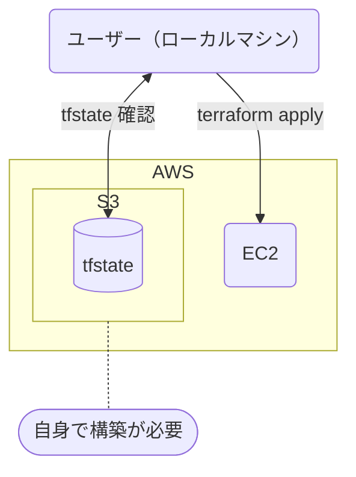
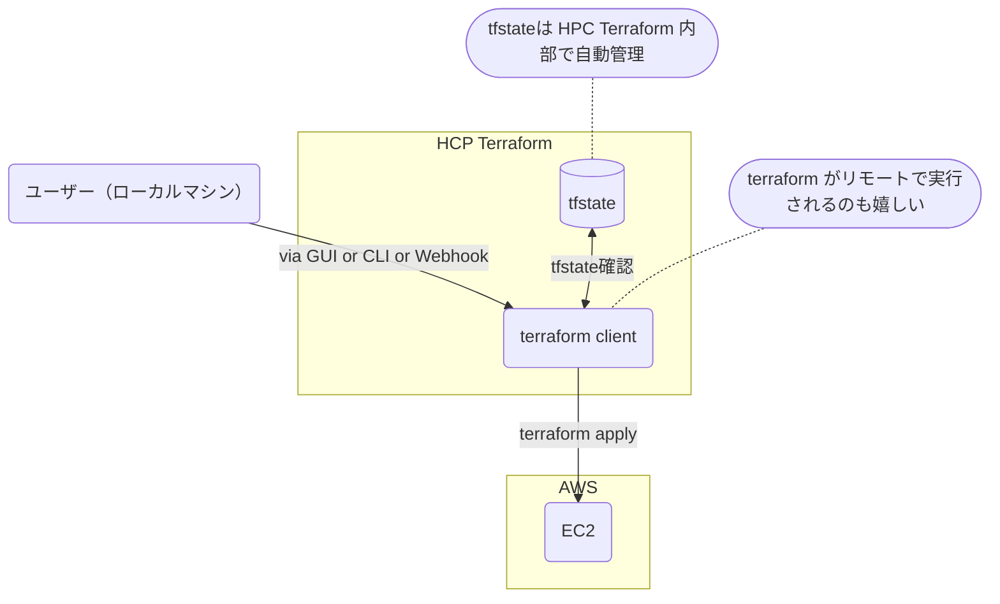
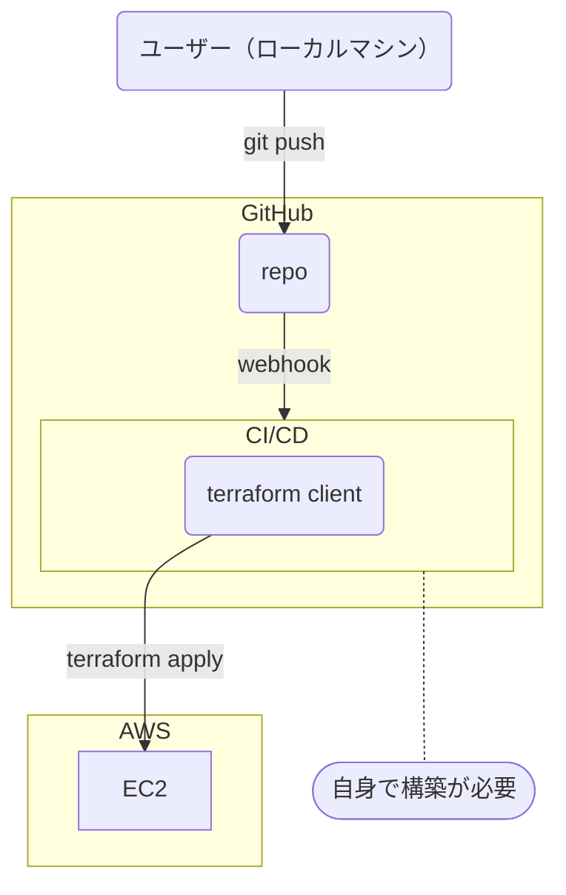
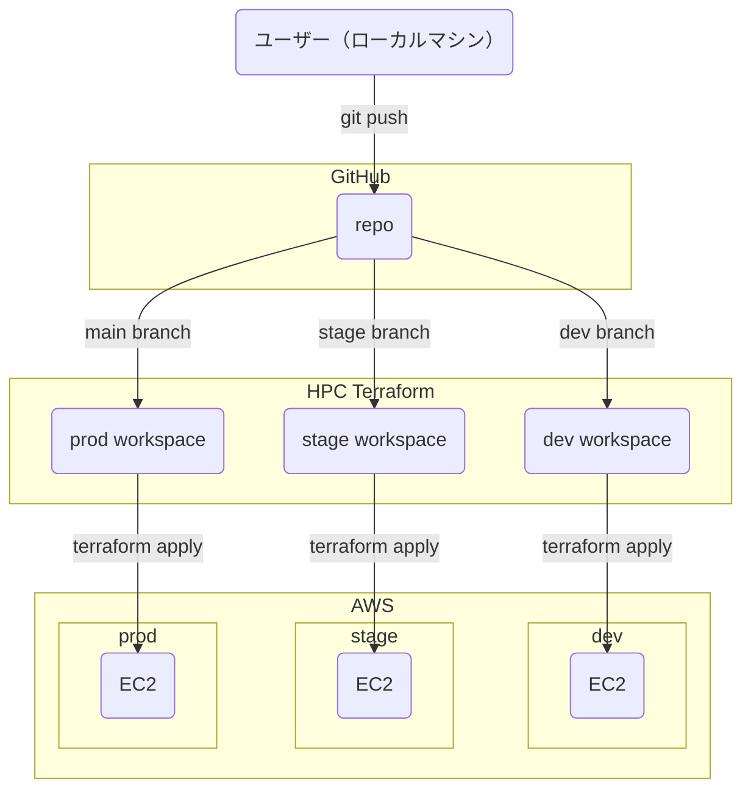

## はじめに

Terraform には CE（コミュニティエディション）版[^1]と SaaS 版、オンプレ版の 3 つの提供形態がある。CE 版についてはある程度知っていたが、それ以外に触れる機会がなかったので概要を勉強した上で、本記事では SaaS 版である HCP Terraform を導入する場合のメリットを整理してみた。

## TL;DR

HCP Terraform を導入する大きなメリットは下記 3 点だと思う。

- tfstate の管理
- VCS との連携（CI/CD）
- セキュリティとガバナンスの強化

それを踏まえると下記のような判断になるのではないだろうか。

- 単なる運用の標準化・効率化（コード化、再利用、バージョン管理など）が目的
  - CE 版 Terraform で十分
- 組織的なガバナンス、チーム横断の運用効率化、セキュリティや一元管理、CI/CD 連携などが求められる場合
  - HCP Terraform の導入を検討する

## HCP Terraform とは

そもそも HCP Terraform についてだが、一言でいうと「Terraform をチーム・組織で運用していく上でいろんな便利な機能を備えた SaaS サービス」である。

https://developer.hashicorp.com/terraform/cloud-docs

いろんな機能が提供されているため、本記事で全ての機能には触れないが、CE 版と比較して SaaS 版を契約するメリットについて後述していこうと思う。

ちなみに各提供形態の名称については以下の通りである。

- CE 版: Terraform
  - 旧名称だと Terraform Cloud と呼ばれている時期もあったので、こちらが馴染みのある人も多いかも知れない。
- SaaS 版: HCP Terraform
- オンプレ版: Terraform Enterprise

## HCP Terraform のメリット

### tfstate の管理

HCP Terraform を利用するメリットの一つは、Terraform の tfstate ファイルをクラウド上で安全かつ一元的に管理できる点だと思う。

tfstate ファイルの管理については、チーム開発だとローカルで管理する訳にはいかないので、自前でリモートバックエンド（例えば AWS だと S3 のようなオブジェクトストレージ）を使った管理になるだろう。しかし、競合や破損、アクセス権限の管理、バックアップ運用、そもそもそのバックエンドの S3 などは Terraform で管理しないのかなど、、、クリティカルなものを扱うが故に地味に検討するポイントが多かった。

HCP Terraform では、各ワークスペースごとに tfstate ファイルを自動的に管理され、ロックやバージョン管理も標準でサポートされている。そのため、複数人での同時作業でも tfstate ファイルの競合や上書き事故を防ぐことができ、過去のバージョンを GUI から簡単にロールバックできる。

さらに、tfstate ファイルは暗号化されて保存されるため、セキュリティ面でも安心できる。

### VCS との連携（CI/CD）

HCP Terraform のもう一つの大きな特徴が、GitHub や GitLab、Bitbucket など主要なバージョン管理システム（VCS）とシームレスに連携できる点だ。

VCS で Terraform コードを管理しつつ、手組で CI/CD を構築する必要があった。具体的には、CI 上で AWS などのクラウドのリソースをプロビジョニングするためのアクセスキー（あるいは assume role）などを設定しておく必要がある。

しかし、HCP Terraform で VCS 連携を有効にすると、例えば PR（Pull Request）作成や更新をトリガーに自動で `terraform plan` を実行し、PR マージをトリガーに `terraform apply` を実行する、といった CI/CD ワークフローをすぐに構築できる。

すなわち、インフラの変更がコードレビューや承認フローを経て安全に本番環境へ反映される仕組みをノーコードで実現できる。

上記の図の通り、「どのブランチにコードが push されたら、どの環境にデプロイをする」といったことを HCP Terraform 内に workspace を GUI で切って設定をするだけで簡単に実現できる。

プロダクトごとや GitHub のリポジトリごとに似たような CI/CD を毎回構築しているような組織や会社は個人的に多いような気がしていて、**HCP Terraform のダッシュボード上で一括で管理できるのは組織全体を見ているようなチームからしたら標準化と、効率化の側面から嬉しいのではないだろうか。**

### セキュリティとガバナンスの強化

HCP Terraform では、組織的なセキュリティやガバナンスを強化するためのさまざまな機能が標準で提供されている。例えば、コードによるポリシー管理（Policy as Code）によって、組織独自のルールやコンプライアンス要件を自動的に適用できる。

また、RBAC 機能によりユーザーやチームごとに細かく権限を設定できたり、重要な変更に対して承認フローを組み込むことで、意図しない操作やヒューマンエラーを防止でききる。すべての操作履歴は監査ログとして記録されるため、後から誰が何をしたかを追跡でき、セキュリティやガバナンスの観点でも Terraform を安心して利用可能な体制を作ることができる。

## まとめ

今回は、Terraform の SaaS 版である HCP Terraform のメリットについて 3 点に絞って解説した。

細かいことを言えば、Private Registry や Const Estimation などまだまだ語り足りないところもあるがが SaaS 版を契約する際にコストメリットに最も関わる部分はこのあたりかなと思う。

是非 HCP Terraform の採用を検討している方や組織は参考してもらえればと思う。

また、今回紹介できていない機能についてもう少し深堀りできたらそのうち記事したい。

## 参考

https://developer.hashicorp.com/terraform/cloud-docs

https://zenn.dev/chario/books/tfc-aws-introductory-book

https://amzn.to/4lEVnt5

https://amzn.to/42lAPOW

https://amzn.to/4jdqAlE

[^1]: Terraform は 2023 年頃ライセンス変更があり、純粋な OSS ではなくなった。Terraform のライセンス変更に関しての詳細はこちら。 https://www.hashicorp.com/en/blog/hashicorp-adopts-business-source-license
