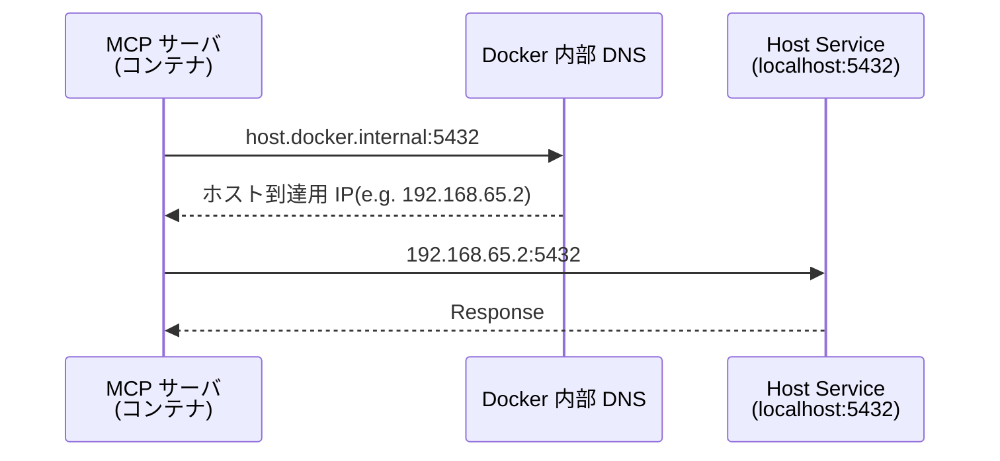

## はじめに

2025 年も終わろうとしているが、ここ 1 年は LLM 搭載の IDE から MCP サーバを使って開発することが増えた。

MCP サーバはローカルで **Docker コンテナ** として立てて動かすことが現状多いので、その状況においていくつか意識していることを書いてみる。なお、本記事では **VS Code の Roo Code 拡張**を前提として説明するが、他の LLM 機能搭載の IDE を使っている方は脳内で置き換えて考えてくれればと思う（おそらく大した違いはないように記載できているはず）。

### MCP（Model Context Protocol）とは

MCP は、LLM アプリケーションが外部ツールやデータソースと標準化された方法で連携するためのプロトコルである。これにより、AI エージェントがファイルシステム、データベース、API などに安全にアクセスできるようになる。標準入出力（stdio）を使った通信方式が基本となっており、Docker コンテナとの相性も良い。

https://modelcontextprotocol.io/

https://github.com/modelcontextprotocol/servers

## ネイティブ実行 VS Docker コンテナ実行

MCP サーバをローカルで動作させる際、個人的にはコンテナで実行したい。理由としては簡単でコンテナの特性を活かして下記のようなメリットを享受したいからである。

- **環境の分離:** ホストマシンに特定のランタイムや依存ライブラリをインストールする必要がない。
- **セキュリティ:** ホストマシンと隔離した環境で動作させることによって MCP サーバがアクセスできる範囲を限定できる。
- **ポータビリティ:** 環境構築などの手間がはぶけるためポータビリティが非常に高い。つまりチーム内で同じ環境を再現しやすく使い回しも容易。

それぞれの場合の mcp.json の書き方を示す。ここでは Playwright MCP[^1] を例にしている。

**ネイティブ実行の場合**

```json:mcp.json showLineNumbers
{
  "mcpServers": {
    "playwright": {
      "command": "npx",
      "args": [
        "@playwright/mcp@latest"
      ]
    }
  }
}
```

**コンテナ実行の場合**

```json:mcp.json showLineNumbers
{
  "mcpServers": {
    "playwright": {
      "command": "docker",
      "args": [
        "run",
        "-i",
        "--rm",
        "--init",
        "--pull=always",
        "mcr.microsoft.com/playwright/mcp"
      ]
    }
  }
}
```

ネイティブ実行ではホスト上で直接コマンドを実行するのに対し、コンテナ実行では `docker run` コマンドでコンテナを起動する点が異なる。

## MCP サーバ起動時によく使うオプション

MCP サーバをコンテナで実行する際によく使うオプションを説明する。

- **`-i`**: 標準入力を開いたまま（MCP の stdio 通信に必須）
- **`--init`**: PID 1 プロセスとして init を使用（ゾンビプロセス対策）
- **`-v`**: ボリュームマウント（ファイルアクセス用）
- **`-p`**: ポートフォワード（ホストからコンテナへ直接にアクセス）

これらについて一つずつ説明する。

### `-i(--interactive)` オプション

MCP の通信プロトコルは標準入出力を使用するため、Docker 実行時に `-i` を指定しないとクライアントとコンテナ間の通信パイプが確立されず、接続エラー（Timeout）になる。常に `-i` を付けて標準入力を開いたままにしておくことが重要である。

### `--init` オプション

PID 1 プロセスとして init を使用することで、ゾンビプロセスの発生を防ぐ。Docker コンテナ内で実行されるプロセスは通常 PID 1 として起動されるが、PID 1 には特別な責任があり、子プロセスの終了処理を適切に行う必要がある。`--init` フラグを指定することで、軽量な init プロセス（tini）が PID 1 として起動され、シグナルの転送やゾンビプロセスの刈り取りを自動的に処理してくれる。長時間実行するコンテナや、子プロセスを生成する可能性がある MCP サーバでは特に推奨される。

下記の記事がとても参考になるので詳しく知りたければこちらも読んでもらうと良い。

https://christina04.hatenablog.com/entry/docker-init

https://qiita.com/ko1nksm/items/e8c2fbf58687e6979448

### `-v(--volume)` オプション

ホストのディレクトリやファイルをコンテナ内にマウントするオプションである。MCP サーバがファイルシステムにアクセスする際に必要となる。

例えば、Playwright MCP サーバでスクリーンショットをローカルマシン上に保存したい場合や、SQLite MCP サーバでデータをローカルに永続化したい場合に使用する。また、ログファイルやドキュメントを読み取り専用で MCP サーバに提供する場合にも活用できる。

基本的に下記のようなかたちで指定する。

```sh
$ docker run -v <ホストのパス>:<コンテナ内のパス>[:<オプション>]

# オプションは下記の 2 パターン
# - `:ro` - 読み取り専用（read-only）
# - `:rw` - 読み書き可能（read-write、デフォルト）
```

LLM に読み書きを許可するボリュームマウントを最小限に絞ることで、誤操作のリスクを減らせる。必要最小限のディレクトリのみをマウントし、可能な限り読み取り専用にすることを推奨する。


https://qiita.com/tbpgr/items/5ff706ce2c62bffafd88

### `-p(--publish)` オプション

コンテナ内のポートをホスト側に公開するオプションである。SSE(Server-Sent Events) 接続など、MCP サーバを HTTP サーバとして常時起動する特定のケースで使用する。 この記事で扱っている stdio 接続（Roo Code など）では通常不要という認識である。

基本的な構文は以下の通りである。

```sh
$ docker run -p <ホストのポート>:<コンテナのポート>

# 例: コンテナ内のポート 9000 をホストの 9000 番ポートに公開
# -p 9000:5432
```

一方、コンテナからホスト側へのアクセス（MCP サーバからホスト上の DB や API へのアクセス）の場合は、`host.docker.internal` をエンドポイントに指定する。これにより、ホスト側つまり `localhost` に到達できる。



なお、`host.docker.internal` は Docker Desktop や Rancher Desktop で利用可能な機能である。Linux でネイティブに Docker Engine を使用している場合は、代わりに `--add-host=host.docker.internal:host-gateway` オプションを指定するか、ホストのネットワークインターフェースの IP アドレスを直接指定する必要がある。

## まとめ

以上が MCP サーバを Docker コンテナで動作させる際に個人的に意識していることだった。

まず Docker コンテナを使うことで、ローカル環境を汚すことなく、さまざまな MCP サーバを簡単に起動できる。

そして、紹介した MCP サーバ起動時のオプションの使い方とその意図を理解した上で活用することで、安全かつ効率的に MCP サーバを利用できると思う。

MCP についてはまだまだ発展途上の技術ではあるので、動向をキャッチアップしていきたい。より深く学びたい方は、おすすめの書籍を掲載しているのでぜひ参照してもらえればと思う。

## 参考

https://amzn.to/4aWy5Mw

https://amzn.to/4jgGFI3

https://amzn.to/4rgPx48

[^1]: https://github.com/microsoft/playwright-mcp
